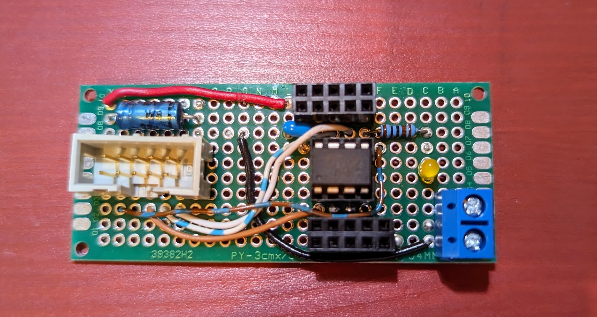

# pgmadapt - simple program adapter for ATtiny

 

### using mySmartUSB: ###
* https://shop.myavr.de/index.php?sp=article.sp.php&artID=200006
* install driver - https://shop.myavr.de/index.php?sp=download.sp.php&suchwort=DL46
* use SupportBox tool - https://shop.myavr.de/index.php?sp=download.sp.php&suchwort=DL197
  * update firmware
  * basic configuration
  * power switch, can be used to run ATtiny after programming

### Notes, Arduino IDE 2.x ###
* install board package ATTinyCore - https://github.com/SpenceKonde/ATTinyCore
* select "ATtiny25/45/85 (No bootloader)"
* select USB port for programmer
* select programmmer
  * mySmartUSB is compatible with "Atmel STK500"
* "compile & upload" (shows error: "A programmer is required to upload")
* use "Sketch -> Upload using Programmer"
* (use "Power on" switch from "SupportBox" for first run inside programming environment) 
* (sel-pin: remove external connection (short to ground) before programming)

### additional notes ###
* simple way to set correct clock fuses:
  * "burn bootloader"
  * program again

(todo: schematic of adapter)
